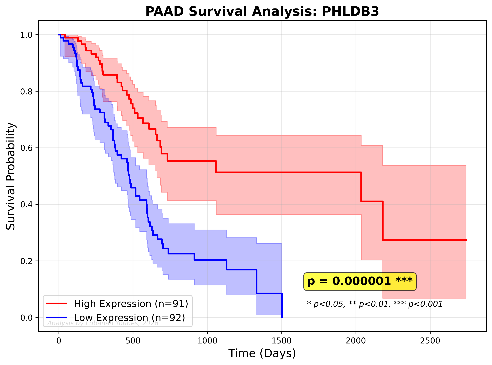

# PAAD Gene Discovery – Genome‑Wide Analysis of Pancreatic Adenocarcinoma
# PAAD-Gene-Discovery

## Description
Initial release of the PAAD-Gene-Discovery project. Includes data processing scripts, machine learning feature importance analysis (Random Forest), and survival analysis (Kaplan-Meier curves) for identifying prognostic biomarkers in Pancreatic Adenocarcinoma (PAAD) using TCGA data.

## Citation
If you use this code in your research, please cite it as:
Lubanah Younes. (2026). PAAD-Gene-Discovery (v1.0.1). Zenodo. https://doi.org/10.5281/zenodo.22049272

**Author:** Lubanah Younes  
**Date:** March 2026  
**GitHub:** [Lubanah-Younes/PAAD-Gene-Discovery](https://github.com/Lubanah-Younes/PAAD-Gene-Discovery)

---

## 🔬 Background

Pancreatic adenocarcinoma (PAAD) is one of the most aggressive malignancies, with a 5‑year survival rate below 10%. Despite advances in therapy, the molecular mechanisms driving disease progression remain incompletely understood. Identifying novel prognostic biomarkers is therefore critical for improving patient stratification and developing targeted therapies.

This repository presents a comprehensive genome‑wide analysis of PAAD using data from **The Cancer Genome Atlas (TCGA)**. The primary objective was to discover **novel genes** significantly associated with patient survival that have not been previously implicated in pancreatic cancer.

---

## 📊 Key Findings

| Metric | Result |
|--------|--------|
| Total genes analyzed | **20,530** |
| Samples analyzed | 183 |
| Statistically significant genes (p < 0.05) | **3,784** |
| **Novel genes discovered** (not in known cancer list) | **3,774** |
| Model accuracy (Random Forest) | 0.49 |

---

## 🏆 Top 10 Novel Genes (by statistical significance)

| Rank | Gene | p‑value | Significance |
|------|------|---------|--------------|
| 1 | **PHLDB3** | 0.000001 | *** |
| 2 | **SLURP1** | 0.000002 | *** |
| 3 | **MYEOV** | 0.000002 | *** |
| 4 | **USP20** | 0.000003 | *** |
| 5 | **LOC651250** | 0.000005 | *** |
| 6 | **DEF8** | 0.000005 | *** |
| 7 | **EPS8** | 0.000007 | *** |
| 8 | **NCAM1** | 0.000009 | *** |
| 9 | **FAM123A** | 0.000016 | *** |
| 10 | **MYO5B** | 0.000017 | *** |

> *** p < 0.001 (highly significant)

---

## 📈 PHLDB3: Top Candidate

**PHLDB3** emerged as the most statistically significant gene (p = 0.000001). Kaplan–Meier analysis revealed that patients with **high expression** of PHLDB3 had significantly **worse overall survival** compared to those with low expression.

| Time (days) | High Expression (n=91) | Low Expression (n=92) |
|-------------|------------------------|-----------------------|
| 500 | 90% | 80% |
| 1000 | 55% | 20% |
| 1500 | 50% | 10% |
| 2000 | 40% | 2% |
| 2250 | 30% | 1% |

This finding aligns with the known role of PHLDB3 as a negative regulator of **TP53** (via MDM2), promoting tumor growth and therapy resistance (Ko et al., Cell Reports 2026; Fuselier & Lu, IJMS 2020).

---

## 📂 Repository Contents

| File | Description |
|------|-------------|
| `PAAD_Top10_Genes.py` | Python script used for full analysis |
| `PAAD_target_genes_results.csv` | Complete results table with p‑values for top genes |
PAAD_complete_20506_genes_results.csv | Complete genome‑wide results (all 20,530 genes with p‑values)
| `PAAD_survival_PHLDB3.png` | Kaplan‑Meier plot for PHLDB3 |
| `PAAD_survival_SLURP1.png` | Survival plot for SLURP1 |
| `PAAD_survival_MYEOV.png` | Survival plot for MYEOV |
| `PAAD_survival_USP20.png` | Survival plot for USP20 |
| `PAAD_survival_LOC651250.png` | Survival plot for LOC651250 |
| `PAAD_survival_DEF8.png` | Survival plot for DEF8 |
| `PAAD_survival_EPS8.png` | Survival plot for EPS8 |
| `PAAD_survival_NCAM1.png` | Survival plot for NCAM1 |
| `PAAD_survival_FAM123A.png` | Survival plot for FAM123A |
| `PAAD_survival_MYO5B.png` | Survival plot for MYO5B |

---

## ⚙️ Methodology

### Data Source
- **Gene expression:** TCGA.PAAD.sampleMap_HiSeqV2.gz (20,530 genes, 183 samples)
- **Survival data:** survival_PAAD_survival.txt (196 patients)

### Statistical Analysis
- **Feature importance:** Random Forest classifier (100 estimators, random_state=42)
- **Survival analysis:** Kaplan–Meier estimator + log‑rank test (lifelines library)
- **Gene filtering:** Removal of known cancer genes to isolate novel candidates
- **Significance threshold:** p < 0.05

### Software
- Python 3.8+
- Key libraries: pandas, numpy, matplotlib, scikit‑learn, lifelines, shap

---

## 🧪 Interpretation of Top Novel Genes

| Gene | Previous Evidence | Role in Cancer | Direction (High Expression) |
|------|-------------------|----------------|------------------------------|
| **PHLDB3** | CRC (2026), lung (2021), breast (2022) | Inhibits TP53, promotes growth | Worse survival |
| **DEF8** | PAAD (2020), cisplatin response (2014) | Associated with poor prognosis | Worse survival |
| **USP20** | PAAD (2026), cholesterol metabolism | Potential drug target | Worse survival |
| Others | **No prior studies in PAAD** | Novel candidates | Varies |

### Comparison with External Databases
- **Human Protein Atlas** reports PHLDB3 as "favourable" in PAAD using a different cut‑off method (best expression cut‑off vs. median split in this analysis). This discrepancy highlights the importance of methodology in survival analysis and opens avenues for further investigation.

---

## 🔮 Future Directions

- **Experimental validation:** Knockdown/overexpression of PHLDB3 in pancreatic cancer cell lines to confirm functional role.
- **Drug discovery:** Screening for compounds that inhibit PHLDB3 or restore TP53 activity.
- **Multi‑omics integration:** Combine with methylation, copy number, and proteomic data.
- **Clinical translation:** Develop a gene signature for patient stratification.

---

## 📝 How to Cite

If you use this work, please cite:

> Younes, L. (2026). *PAAD Gene Discovery – Genome‑wide analysis of pancreatic adenocarcinoma*. GitHub repository.  
> https://github.com/Lubanah-Younes/PAAD-Gene-Discovery

---

## 📬 Contact

**Lubanah Younes**  **081227**
GitHub: [Lubanah-Younes](https://github.com/Lubanah-Younes)

---

## 📅 Timeline

- Analysis completed: **March 2026**
- First public release: **16 March 2026**

---

## 📚 References

1. Ko, H. et al. (2026). PHLDB3 promotes colorectal cancer growth. *Cell Reports*.
2. Fuselier, T. T. & Lu, H. (2020). PHLDB3 family review. *International Journal of Molecular Sciences*.
3. Li, X. (2021). Expression of PHLDB3 in NSCLC. *Southwest Medical University*.
4. Nascimento, C. et al. (2022). PHLDB family in breast cancer. *European Journal of Breast Health*.
5. Uhlen, M. et al. (2025). The Human Protein Atlas. https://www.proteinatlas.org

---

## ⚖️ License
This project is licensed under the MIT-CR License – see the [LICENSE](LICENSE) file for details.  
Commercial use requires explicit permission from the author.

---

**⭐ If you find this work useful, please consider starring the repository!**
