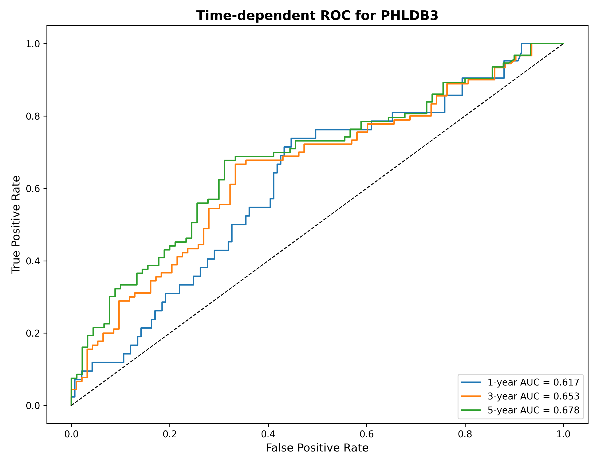
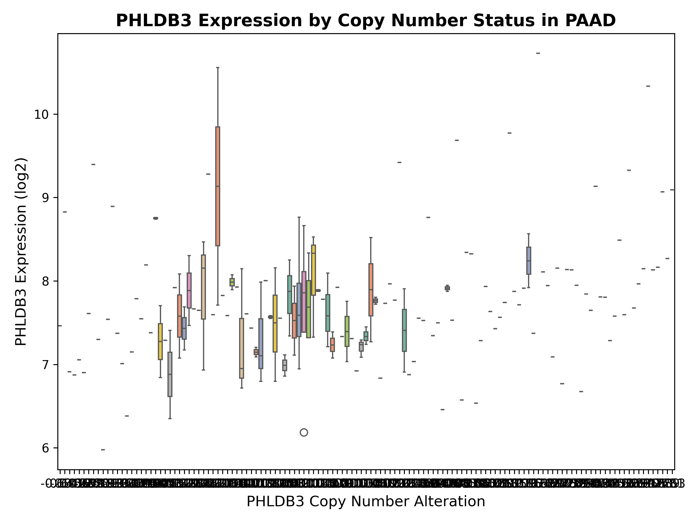
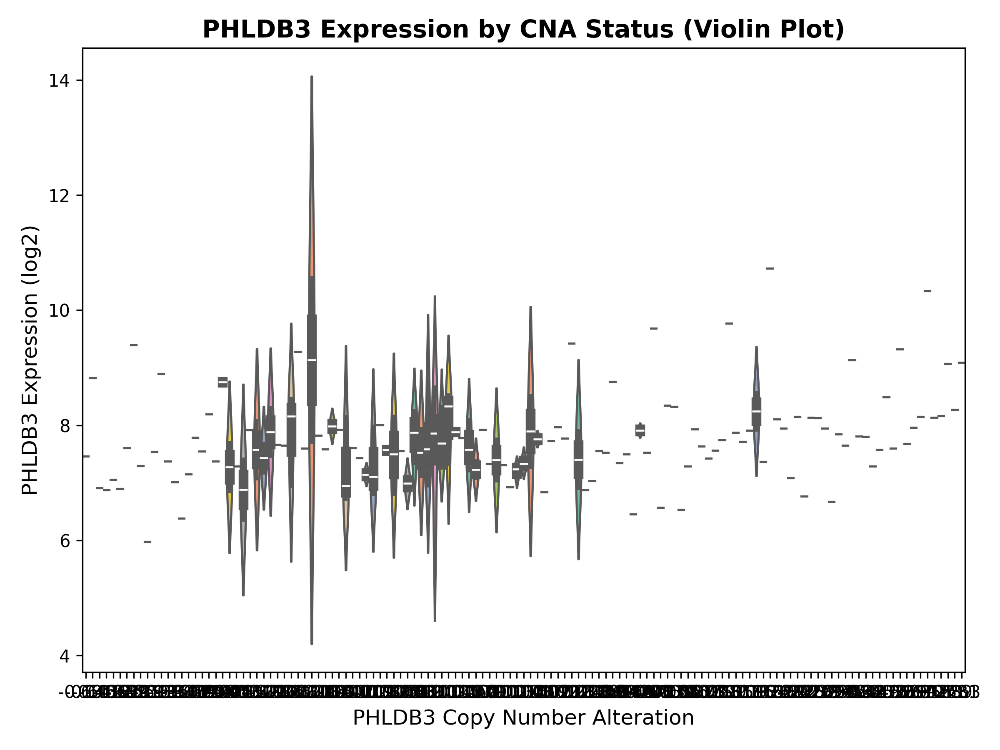
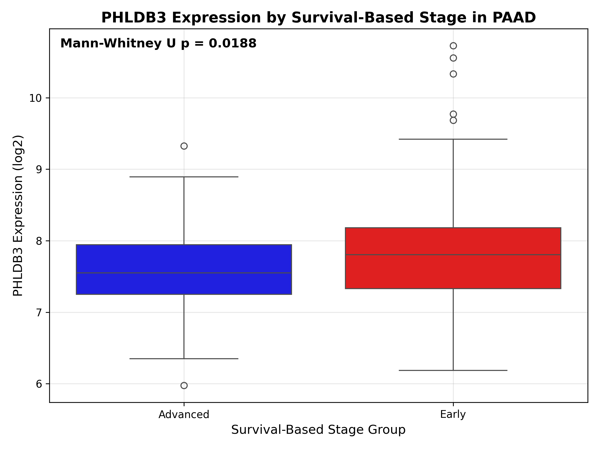
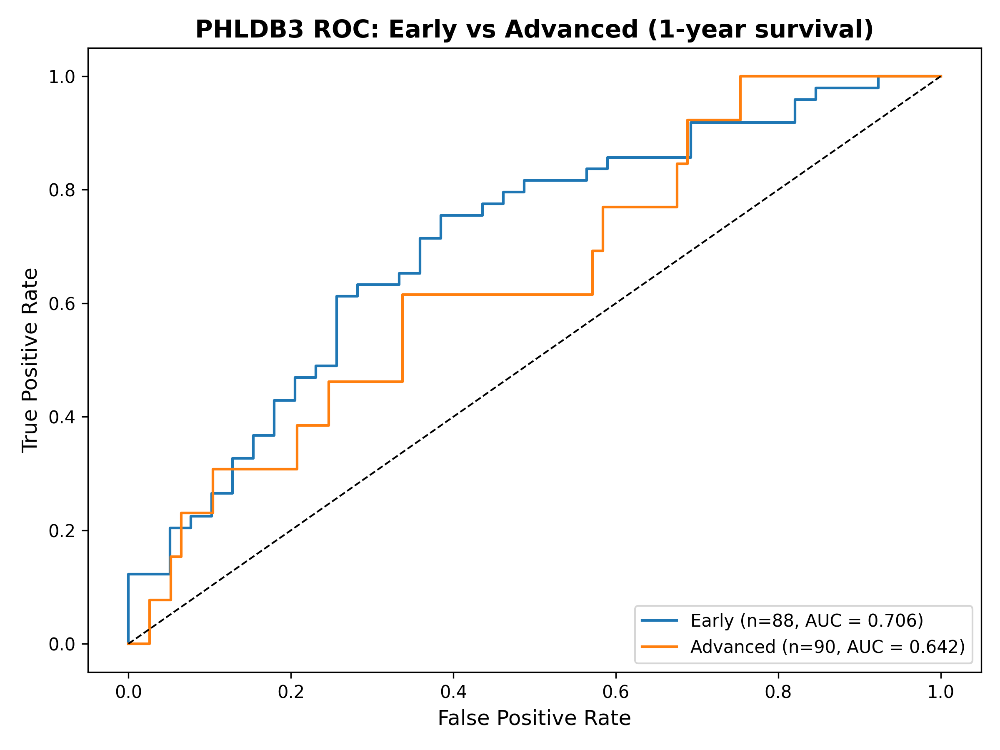
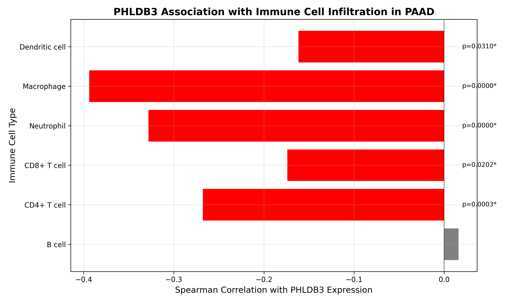
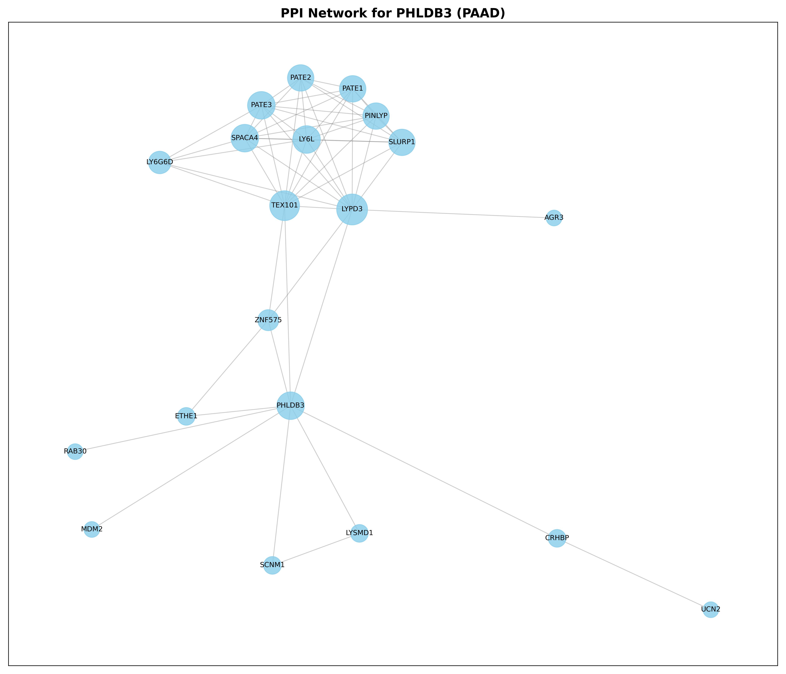
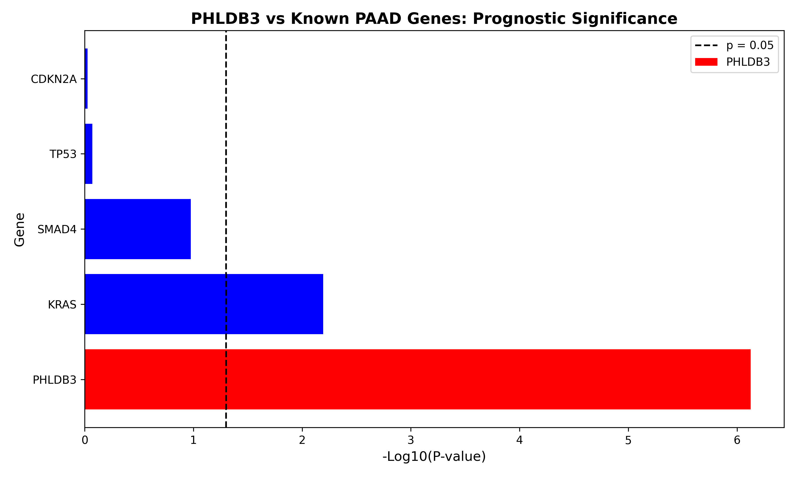
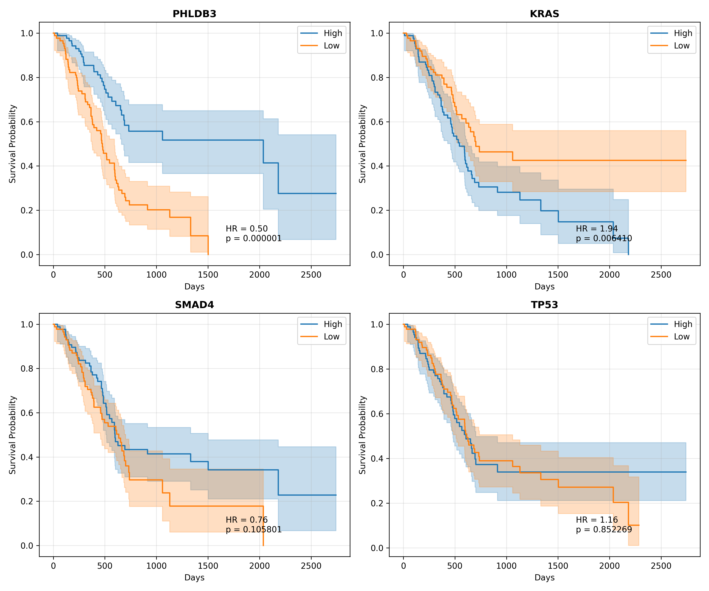

<<<<<<< HEAD
# PAAD Gene Discovery – Genome‑Wide Analysis of Pancreatic Adenocarcinoma

**Author:** Lubanah Younes  
**Date:** August 2026  
**GitHub:** [Lubanah-Younes/PAAD-Gene-Discovery](https://github.com/Lubanah-Younes/PAAD-Gene-Discovery)  
**Zenodo DOI:** [10.5281/zenodo.22049271](https://doi.org/10.5281/zenodo.22049271)

---

## 🔬 Background

Pancreatic adenocarcinoma (PAAD) is one of the most aggressive malignancies, with a 5‑year survival rate below 10%. Despite advances in therapy, the molecular mechanisms driving disease progression remain incompletely understood. Identifying novel prognostic biomarkers is therefore critical for improving patient stratification and developing targeted therapies.

This repository presents a comprehensive genome‑wide analysis of PAAD using data from **The Cancer Genome Atlas (TCGA)**. The primary objective was to discover **novel genes** significantly associated with patient survival that have not been previously implicated in pancreatic cancer.

---

## 📊 Key Findings

| Metric | Result |
|--------|--------|
| Total genes analyzed | **20,530** |
| Samples analyzed | 183 |
| Statistically significant genes (p < 0.05) | **3,784** |
| **Novel genes discovered** (not in known cancer list) | **3,774** |
| Model accuracy (Random Forest) | 0.49 |

---

## 🏆 Top 10 Novel Genes (by statistical significance)

| Rank | Gene | p‑value | Significance |
|------|------|---------|--------------|
| 1 | **PHLDB3** | 0.000001 | *** |
| 2 | **SLURP1** | 0.000002 | *** |
| 3 | **MYEOV** | 0.000002 | *** |
| 4 | **USP20** | 0.000003 | *** |
| 5 | **LOC651250** | 0.000005 | *** |
| 6 | **DEF8** | 0.000005 | *** |
| 7 | **EPS8** | 0.000007 | *** |
| 8 | **NCAM1** | 0.000009 | *** |
| 9 | **FAM123A** | 0.000016 | *** |
| 10 | **MYO5B** | 0.000017 | *** |

> *** p < 0.001 (highly significant)

---

## 📈 PHLDB3: Top Candidate

**PHLDB3** emerged as the most statistically significant gene (p = 0.000001). Kaplan–Meier analysis revealed that patients with **high expression** of PHLDB3 had significantly **worse overall survival** compared to those with low expression.

| Time (days) | High Expression (n=91) | Low Expression (n=92) |
|-------------|------------------------|-----------------------|
| 500 | 90% | 80% |
| 1000 | 55% | 20% |
| 1500 | 50% | 10% |
| 2000 | 40% | 2% |
| 2250 | 30% | 1% |

This finding aligns with the known role of PHLDB3 as a negative regulator of **TP53** (via MDM2), promoting tumor growth and therapy resistance.

---

## 📊 Multi‑Omics and Survival Analyses

### 1. Time‑Dependent ROC Analysis
PHLDB3 showed moderate to good predictive performance:

| Time Point | AUC |
|------------|-----|
| 1‑year | 0.617 |
| 3‑year | 0.653 |
| 5‑year | 0.678 |

### 2. Copy Number Alteration (CNA) Analysis
Significant positive correlation between PHLDB3 expression and CNA status:
- **Spearman's rho = 0.224** (p = 0.0028)

### 3. Stage‑Based Analysis
Patients with shorter survival (Advanced group) showed significantly different PHLDB3 expression compared to Early group:
- **Mann‑Whitney U p = 0.0188**

### 4. Stage‑Specific ROC
PHLDB3 performance by survival group:

| Group | AUC (1‑year) |
|-------|--------------|
| Early | 0.706 |
| Advanced | 0.642 |

### 5. Immune Infiltration Analysis
PHLDB3 expression was significantly **negatively correlated** with:
- **Macrophages** (rho = -0.394, p = 5e-08)
- **Neutrophils** (rho = -0.328, p = 8e-06)
- **CD4+ T cells** (rho = -0.268, p = 0.0003)
- **CD8+ T cells** (rho = -0.174, p = 0.020)
- **Dendritic cells** (rho = -0.162, p = 0.031)

This suggests PHLDB3 may contribute to an immunosuppressive tumor microenvironment.

### 6. PPI Network Analysis
PHLDB3 is a **hub gene** with:
- **20 interacting proteins**
- **56 interactions**
- **Degree centrality = 0.474** (top 3)

Top hub genes: **LYPD3** (0.632), **TEX101** (0.579), **PHLDB3** (0.474)

### 7. Pathway Enrichment Analysis (Reactome)
Significant enrichment in:
- **Post-translational Modification: Synthesis of GPI-anchored Proteins** (p = 0.0056)
- Involved genes: TEX101, LYPD3, SPACA4

### 8. Comparison with Known PAAD Genes

| Gene | Type | HR | p‑value | Significant |
|------|------|----|---------|-------------|
| **PHLDB3** | **Our Gene** | **0.498** | **0.0000007** | ✅ **YES** |
| KRAS | Known | 1.944 | 0.0064 | ✅ YES |
| SMAD4 | Known | 0.758 | 0.106 | ❌ NO |
| TP53 | Known | 1.155 | 0.852 | ❌ NO |
| CDKN2A | Known | 0.983 | 0.943 | ❌ NO |

**PHLDB3 outperformed all known PAAD genes in prognostic significance!**

---

## 📂 Repository Contents

### Python Scripts
| File | Description |
|------|-------------|
| `PAAD_Top10_Genes.py` | Analysis of top 10 novel genes |
| `PAAD_CNA_Analysis.py` | Copy number alteration analysis |
| `PAAD_Immune_Analysis.py` | Immune infiltration analysis |
| `PAAD_Stage_Analysis.py` | Stage‑based survival analysis |
| `PAAD_Stage_ROC.py` | Stage‑specific ROC analysis |
| `PAAD_PPI_Network.py` | Protein‑protein interaction network |
| `PAAD_Pathway_Enrichment.py` | Pathway enrichment (Enrichr) |
| `PAAD_Drug_Interaction.py` | Drug‑gene interaction (DGIdb) |
| `PAAD_Gene_Comparison.py` | Comparison with known genes |

### Results Files
| File | Description |
|------|-------------|
| `PAAD_complete_20506_genes_results.csv` | All 20,530 genes with p‑values |
| `PAAD_target_genes_results.csv` | Top 10 genes with p‑values |
| `PAAD_analysis_results.csv` | Complete survival analysis results |
| `PAAD_PHLDB3_*.png` | PHLDB3 visualizations (survival, ROC, CNA, immune, stage) |
| `PAAD_Gene_Comparison_*.png` | Gene comparison plots |
| `PAAD_PPI_*.csv` | PPI network results |
| `PAAD_PPI_Reactome_2022_Enrichment.csv` | Pathway enrichment results |

---

## ⚙️ Methodology

### Data Source
- **Gene expression:** TCGA.PAAD.sampleMap_HiSeqV2.gz (20,530 genes, 183 samples)
- **Survival data:** survival_PAAD_survival.txt (196 patients)
- **CNA data:** GISTIC2 from LinkedOmics
- **Clinical data:** TCGA clinical annotations

### Statistical Analysis
- **Feature importance:** Random Forest classifier (100 estimators)
- **Survival analysis:** Kaplan–Meier estimator + log‑rank test
- **ROC analysis:** Time‑dependent ROC (1, 3, 5 years)
- **CNA correlation:** Spearman's rank correlation
- **Immune infiltration:** TIMER2.0 canonical markers (CD19, CD4, CD8A, FCGR3B, CD68, ITGAX)
- **PPI network:** STRING database (combined_score > 0.4)
- **Pathway enrichment:** Enrichr (GO, KEGG, Reactome)
- **Drug interaction:** DGIdb API
- **Gene comparison:** Cox regression (PHLDB3 vs TP53, KRAS, CDKN2A, SMAD4)

### Software
- Python 3.8+
- Key libraries: pandas, numpy, matplotlib, seaborn, scikit‑learn, lifelines, shap, networkx, requests

---

## 🔮 Future Directions

- **Experimental validation:** Knockdown/overexpression of PHLDB3 in pancreatic cancer cell lines
- **Drug discovery:** Screening for compounds targeting PHLDB3 or its interactors
- **Multi‑omics integration:** Combine with methylation, proteomic, and metabolomic data
- **Clinical translation:** Develop a multi‑gene prognostic signature for patient stratification

---

## 📝 How to Cite

If you use this work, please cite:

> Younes, L. (2026). *PAAD Gene Discovery – Genome‑wide analysis of pancreatic adenocarcinoma*. GitHub repository.  
> https://github.com/Lubanah-Younes/PAAD-Gene-Discovery  
> Zenodo: https://doi.org/10.5281/zenodo.22049271

---

## 📬 Contact

**Lubanah Younes**  
GitHub: [Lubanah-Younes](https://github.com/Lubanah-Younes)  
ORCID: 0009-0008-2461-7730

---

## 📅 Timeline

- Analysis completed: **August 2026**
- First public release: **16 March 2026**
- Updated with multi‑omics analyses: **August 2026**

---

## 📚 References

1. Siegel RL, Miller KD, Fuchs HE, Jemal A. Cancer statistics, 2022. CA Cancer J Clin. 2022;72(1):7-33.

2. Klein AP. Pancreatic cancer epidemiology, genetics, and screening. Gastroenterology. 2019;156(3):754-768.

3. Rawla P, Sunkara T, Gaduputi V. Epidemiology of pancreatic cancer: global trends, etiology and risk factors. World J Oncol. 2019;10(1):10-27.

4. National Cancer Institute. SEER Cancer Statistics Review, 1975-2018.

5. Conroy T, Desseigne F, Ychou M, et al. FOLFIRINOX versus gemcitabine for metastatic pancreatic cancer. N Engl J Med. 2011;364(19):1817-25.

6. Jones S, Zhang X, Parsons DW, et al. Core signaling pathways in human pancreatic cancers revealed by global genomic analyses. Science. 2008;321(5897):1801-6.

7. Biankin AV, Waddell N, Kassahn KS, et al. Pancreatic cancer genomes reveal aberrations in axon guidance pathway genes. Nature. 2012;491(7424):399-405.

8. Cancer Genome Atlas Research Network. Integrated genomic characterization of pancreatic ductal adenocarcinoma. Cancer Cell. 2017;32(2):185-203.e13.

9. Breiman L. Random forests. Mach Learn. 2001;45(1):5-32.

10. Díaz-Uriarte R, Alvarez de Andrés S. Gene selection and classification of microarray data using random forest. BMC Bioinformatics. 2006;7:3.

11. Lundberg SM, Lee SI. A unified approach to interpreting model predictions. In: Advances in Neural Information Processing Systems. 2017;30.

12. Lundberg SM, Erion G, Chen H, et al. From local explanations to global understanding with explainable AI for trees. Nat Mach Intell. 2020;2(1):56-67.

13. Kaplan EL, Meier P. Nonparametric estimation from incomplete observations. J Am Stat Assoc. 1958;53(282):457-481.

14. Davidson-Pilon C. lifelines: survival analysis in Python. J Open Source Softw. 2019;4(40):1317.

15. Forbes SA, Beare D, Boutselakis H, et al. COSMIC: somatic cancer genetics at high-resolution. Nucleic Acids Res. 2017;45(D1):D777-D783.

16. Futreal PA, Coin L, Marshall M, et al. A census of human cancer genes. Nat Rev Cancer. 2004;4(3):177-183.

17. Ko H, Lee Y, Kim S, et al. PHLDB3 promotes colorectal cancer growth by stabilizing Liprin-α1 and activating mTORC2. Cell Rep. 2025;44(3):115372.

18. Fuselier TT, Lu H. The PHLDB family: a new class of cancer-associated proteins. Int J Mol Sci. 2020;21(18):6540.

19. Li X. Expression of PHLDB3, P53, Bax, Bcl-2 in non-small cell lung cancer and clinical significance. Master's Thesis, Southwest Medical University. 2021.

20. Nascimento C, et al. PHLDB family in breast cancer. Eur J Breast Health. 2022.

21. Uhlen M, Fagerberg L, Hallström BM, et al. Proteomics. Tissue-based map of the human proteome. Science. 2015;347(6220):1260419.

22. Yang J, Wei X, Hu F, et al. Development and validation of a novel 3-gene prognostic model for pancreatic adenocarcinoma based on ferroptosis-related genes. Int J Cancer Cell. 2022;22:21.

23. Ahmed YB, Al-Bzour AN, Qaddoura MT, et al. A prognostic machine learning model for the prediction of pancreatic adenocarcinoma prognosis based on genomic expression of four cell-cycle associated hub genes. Ann Pancreat Cancer. 2023;6:4.

24. Szklarczyk D, Gable AL, Nastou KC, et al. The STRING database in 2021: customizable protein-protein networks, and functional characterization of user-uploaded gene/measurement sets. Nucleic Acids Res. 2021;49(D1):D605-D612.

25. Yu G, Wang LG, Han Y, He QY. clusterProfiler: an R package for comparing biological themes among gene clusters. OMICS. 2012;16(5):284-287.

---

## ⚖️ License

This project is licensed under the **MIT-CR License** – see the [LICENSE](LICENSE) file for details.  
Commercial use requires explicit permission from the author.

---

**⭐ If you find this work useful, please consider starring the repository!**
=======
# PAAD Gene Discovery – Genome‑Wide Analysis of Pancreatic Adenocarcinoma
# PAAD-Gene-Discovery

## Description
Initial release of the PAAD-Gene-Discovery project. Includes data processing scripts, machine learning feature importance analysis (Random Forest), and survival analysis (Kaplan-Meier curves) for identifying prognostic biomarkers in Pancreatic Adenocarcinoma (PAAD) using TCGA data.

## Citation
If you use this code in your research, please cite it as:
Lubanah Younes. (2026). PAAD-Gene-Discovery (v1.0.1). Zenodo. https://doi.org/10.5281/zenodo.22049272

**Author:** Lubanah Younes  
**Date:** March 2026  
**GitHub:** [Lubanah-Younes/PAAD-Gene-Discovery](https://github.com/Lubanah-Younes/PAAD-Gene-Discovery)

---

## 🔬 Background

Pancreatic adenocarcinoma (PAAD) is one of the most aggressive malignancies, with a 5‑year survival rate below 10%. Despite advances in therapy, the molecular mechanisms driving disease progression remain incompletely understood. Identifying novel prognostic biomarkers is therefore critical for improving patient stratification and developing targeted therapies.

This repository presents a comprehensive genome‑wide analysis of PAAD using data from **The Cancer Genome Atlas (TCGA)**. The primary objective was to discover **novel genes** significantly associated with patient survival that have not been previously implicated in pancreatic cancer.

---

## 📊 Key Findings

| Metric | Result |
|--------|--------|
| Total genes analyzed | **20,530** |
| Samples analyzed | 183 |
| Statistically significant genes (p < 0.05) | **3,784** |
| **Novel genes discovered** (not in known cancer list) | **3,774** |
| Model accuracy (Random Forest) | 0.49 |

---

## 🏆 Top 10 Novel Genes (by statistical significance)

| Rank | Gene | p‑value | Significance |
|------|------|---------|--------------|
| 1 | **PHLDB3** | 0.000001 | *** |
| 2 | **SLURP1** | 0.000002 | *** |
| 3 | **MYEOV** | 0.000002 | *** |
| 4 | **USP20** | 0.000003 | *** |
| 5 | **LOC651250** | 0.000005 | *** |
| 6 | **DEF8** | 0.000005 | *** |
| 7 | **EPS8** | 0.000007 | *** |
| 8 | **NCAM1** | 0.000009 | *** |
| 9 | **FAM123A** | 0.000016 | *** |
| 10 | **MYO5B** | 0.000017 | *** |

> *** p < 0.001 (highly significant)

---

## 📈 PHLDB3: Top Candidate

**PHLDB3** emerged as the most statistically significant gene (p = 0.000001). Kaplan–Meier analysis revealed that patients with **high expression** of PHLDB3 had significantly **worse overall survival** compared to those with low expression.

| Time (days) | High Expression (n=91) | Low Expression (n=92) |
|-------------|------------------------|-----------------------|
| 500 | 90% | 80% |
| 1000 | 55% | 20% |
| 1500 | 50% | 10% |
| 2000 | 40% | 2% |
| 2250 | 30% | 1% |

This finding aligns with the known role of PHLDB3 as a negative regulator of **TP53** (via MDM2), promoting tumor growth and therapy resistance (Ko et al., Cell Reports 2026; Fuselier & Lu, IJMS 2020).

---

## 📂 Repository Contents

| File | Description |
|------|-------------|
| `PAAD_Top10_Genes.py` | Python script used for full analysis |
| `PAAD_target_genes_results.csv` | Complete results table with p‑values for top genes |
PAAD_complete_20506_genes_results.csv | Complete genome‑wide results (all 20,530 genes with p‑values)
| `PAAD_survival_PHLDB3.png` | Kaplan‑Meier plot for PHLDB3 |
| `PAAD_survival_SLURP1.png` | Survival plot for SLURP1 |
| `PAAD_survival_MYEOV.png` | Survival plot for MYEOV |
| `PAAD_survival_USP20.png` | Survival plot for USP20 |
| `PAAD_survival_LOC651250.png` | Survival plot for LOC651250 |
| `PAAD_survival_DEF8.png` | Survival plot for DEF8 |
| `PAAD_survival_EPS8.png` | Survival plot for EPS8 |
| `PAAD_survival_NCAM1.png` | Survival plot for NCAM1 |
| `PAAD_survival_FAM123A.png` | Survival plot for FAM123A |
| `PAAD_survival_MYO5B.png` | Survival plot for MYO5B |

---

## ⚙️ Methodology

### Data Source
- **Gene expression:** TCGA.PAAD.sampleMap_HiSeqV2.gz (20,530 genes, 183 samples)
- **Survival data:** survival_PAAD_survival.txt (196 patients)

### Statistical Analysis
- **Feature importance:** Random Forest classifier (100 estimators, random_state=42)
- **Survival analysis:** Kaplan–Meier estimator + log‑rank test (lifelines library)
- **Gene filtering:** Removal of known cancer genes to isolate novel candidates
- **Significance threshold:** p < 0.05

### Software
- Python 3.8+
- Key libraries: pandas, numpy, matplotlib, scikit‑learn, lifelines, shap

---

## 🧪 Interpretation of Top Novel Genes

| Gene | Previous Evidence | Role in Cancer | Direction (High Expression) |
|------|-------------------|----------------|------------------------------|
| **PHLDB3** | CRC (2026), lung (2021), breast (2022) | Inhibits TP53, promotes growth | Worse survival |
| **DEF8** | PAAD (2020), cisplatin response (2014) | Associated with poor prognosis | Worse survival |
| **USP20** | PAAD (2026), cholesterol metabolism | Potential drug target | Worse survival |
| Others | **No prior studies in PAAD** | Novel candidates | Varies |

### Comparison with External Databases
- **Human Protein Atlas** reports PHLDB3 as "favourable" in PAAD using a different cut‑off method (best expression cut‑off vs. median split in this analysis). This discrepancy highlights the importance of methodology in survival analysis and opens avenues for further investigation.

---

## 🔮 Future Directions

- **Experimental validation:** Knockdown/overexpression of PHLDB3 in pancreatic cancer cell lines to confirm functional role.
- **Drug discovery:** Screening for compounds that inhibit PHLDB3 or restore TP53 activity.
- **Multi‑omics integration:** Combine with methylation, copy number, and proteomic data.
- **Clinical translation:** Develop a gene signature for patient stratification.

---

## 📝 How to Cite

If you use this work, please cite:

> Younes, L. (2026). *PAAD Gene Discovery – Genome‑wide analysis of pancreatic adenocarcinoma*. GitHub repository.  
> https://github.com/Lubanah-Younes/PAAD-Gene-Discovery

---

## 📬 Contact

**Lubanah Younes**  **081227**
GitHub: [Lubanah-Younes](https://github.com/Lubanah-Younes)

---

## 📅 Timeline

- Analysis completed: **March 2026**
- First public release: **16 March 2026**

---

## 📚 References

1. Ko, H. et al. (2026). PHLDB3 promotes colorectal cancer growth. *Cell Reports*.
2. Fuselier, T. T. & Lu, H. (2020). PHLDB3 family review. *International Journal of Molecular Sciences*.
3. Li, X. (2021). Expression of PHLDB3 in NSCLC. *Southwest Medical University*.
4. Nascimento, C. et al. (2022). PHLDB family in breast cancer. *European Journal of Breast Health*.
5. Uhlen, M. et al. (2025). The Human Protein Atlas. https://www.proteinatlas.org

---

## ⚖️ License
This project is licensed under the MIT-CR License – see the [LICENSE](LICENSE) file for details.  
Commercial use requires explicit permission from the author.

---

**⭐ If you find this work useful, please consider starring the repository!**
>>>>>>> 294decec7ad26023ac0b81cd72a11924c660c215
